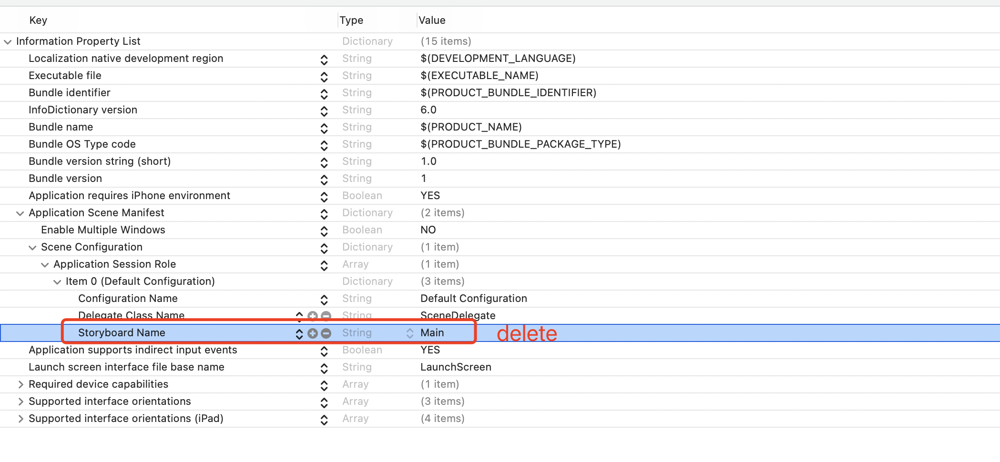
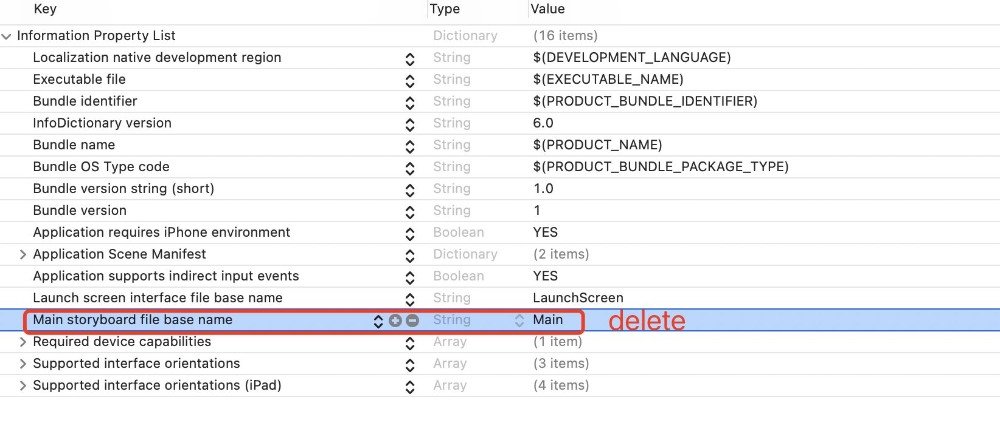
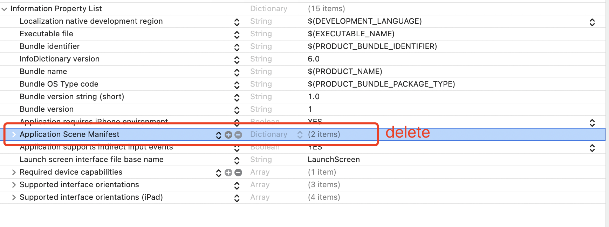

[toc]

# 语法知识

## NSString

```objc
// 创建NSString
NSString *str = @"string";
str = [NSString new];
str = [NSString stringWithFormat:@"string %d", 1];
// 字符串和整数转换 int为例 float等同理
NSString *str = @"123";
int num = [str intValue];
str = [NSString stringWithFormat:@"%d", 1];

```

## 二维数组

```objc
NSMutableArray *array;
array = [[NSMutableArray alloc] init];
for (NSInteger row = 0; row < colNum; row++) {
  NSMutableArray *arrayValue = [[NSMutableArray alloc] init];
  for(NSInteger col = 0; col < rowNum; col++) {
    [arrayValue addObject:@"11"];
  }
  [self.array addObject:arrayValue];
}
```


## 关键字

1. `atomic` 和 `nonatomic` 关键字

   `atomic` 为**默认关键字**，能够保证 setter 和 getter 方法的完整性，`nonatomic` 能够提升性能，但不能保证原子性，两者都是线程不安全的。`atomic` 其底层原理就是对 setter 和 getter 方法进行加锁操作以保存存取值的安全性和完整性，安全性体现在 setter 和 getter 方法内部的安全性，因为加了锁所以导致性能消耗。详见<https://juejin.cn/post/6844904072475049992>

2. `strong` `weak` `assign` `copy` 关键字

   `strong` 表示强引用，指向并拥有该对象，其修饰对象引用计数会加1，而 `weak` 表示弱引用，指向但不拥有该对象，其修饰对象引用计数不会增加。

   `assign` 和 `weak` 一样，但是一般用来修饰基本数据类型，不同之处在于 `assign` 修饰的对象如果被释放的话，指针地址依然存在，造成野指针，在堆上容易造成崩溃。而基本数据类型存在于栈上，系统会自动处理栈，不会有野指针。`weak` 修饰的对象会自动在内存中销毁。`unsafe_unretained` 同 `assign` 一样。

   `copy` 和 `strong` 相似，不同的是 `strong` 是多个指针指向同一个地址，而 `copy` 会每次在内存中复制一份拷贝，指针指向不同地址，一般用于修饰有可变对应类型的不可变对象上，如NSString, NSArray, NSDictionary。


# UIKit

## UITableView

### 使用方法：

1. 在 ViewController.h 文件中实现 UITableViewDelegate, UITableViewDataSource 两个 delegate

```objc
#import <UIKit/UIKit.h>

@interface ViewController : UIViewController<UITableViewDelegate, UITableViewDataSource>
@end
```

2. 在 ViewController.m 文件中给要用的UITableView设置self delegate 这样子就会有代码提示

```objc
self.tableView.delegate = self;
self.tableView.dataSource = self;
```

3. 实现协议的一些方法，如 numberOfSectionsInTableView: ,  tableView: cellForRowAtIndexPath

```objc
- (NSInteger)numberOfSectionsInTableView:(UITableView *)tableView {
    return self.array.count;
}

- (NSInteger)tableView:(UITableView *)tableView numberOfRowsInSection:(NSInteger)section {
    return [self.array[section] count];
}
```

## UIApplication 原理

### 1. 去掉 `storyboard`，保留 `SceneDelegate`，改用纯代码开发

1. 删除 `.storyboard` 文件
2. 删除 `Deployment Info -> Main Interface` 里的入口 `main`
3. 在 `SceneDelegate.m` 文件中引入 `ViewController.h` ，在 `willConnectToSession:options:` 方法中加入以下初始化代码

```objc
// 初始化 self.window
UIWindowScene *windowScene = (UIWindowScene *)scene;
self.window = [[UIWindow alloc] initWithWindowScene:windowScene];
self.window.frame = windowScene.coordinateSpace.bounds;
self.window.backgroundColor = [UIColor whiteColor];

// 这个 ViewController 是新建的时候自带的，需要导入一下头文件
ViewController *vc = [[ViewController alloc] init];
[self.window setRootViewController:vc];
[self.window makeKeyAndVisible];
```

4. 在 `Info.plist` 中删除对 `storyboard` 的引用





### 2. 去掉 `storyboard ` 和  `SceneDelegate`，改用纯代码开发

1 2 同上

3. 在 `AppDelegate.h` 文件中添加 `window` 属性，并在 `AppDelegate.m` 文件中引入 `ViewController.h` ，在 `didFinishLaunchingWithOptions:launchOptions:` 方法中加入初始化代码

```objc
@interface AppDelegate : UIResponder <UIApplicationDelegate>

@property (strong, nonatomic) UIWindow * window;

@end
```

```objc
self.window = [[UIWindow alloc] initWithFrame:[UIScreen mainScreen].bounds];

UIViewController *rootVc = [[ViewController alloc]init];
UINavigationController *rootNav = [[UINavigationController alloc]initWithRootViewController:rootVc];
[self.window setRootViewController:rootNav];
[self.window makeKeyAndVisible];
```


4. 在 `Info.plist` 中删除对 `scene` 的引用 




## ViewController 间页面传值

### 方法一：使用 Delegate

1. 在传值页面 ` NewViewContoller` 的 `NewViewController.h` 中创建 `NewViewControllerDelegate` 代理协议，其包含一个未实现的 `sendValue` 方法用于传递值。

```objc
@protocol NeWViewControllerDelegate <NSObject>

@required

- (void)sendValue: (NSString *) string;

@end
```

2. 给传值页面 ` NewViewContoller` 添加一个对象属性，该对象实现了 `NeWViewControllerDelegate` 协议。传值页面其实就是委托方，它要委托代理方去完成一个功能，这个代理方必须实现委托方规定的协议。使用 `weak` 关键字的原因为防止泄漏，因为第一个页面（接收页面）要设置委托方的代理方为自己: `newView.delegate = self;`。

```objc
@interface NewViewController : UIViewController
@property (strong,nonatomic) NSString *str;
// 
@property (nonatomic, weak, nullable) id <NeWViewControllerDelegate> delegate;
@end
```

3. 在委托方也就是传值页面调用 `sendValue` 方法来设定需要传递的值。

```objc
@implementation
- (void)clickButton {
    [self.navigationController popViewControllerAnimated: YES];
    NSString* str = self.textView.text;
    if (str.length > 0) {
        // 先判断实现代理类有没有这个方法
        if ([self.delegate respondsToSelector:@selector(sendValue:)]) {
            [self.delegate sendValue:str];
            self.sendValueBlock(str);
        }
    }
}

@end
```

4. 代理方实现协议，完成所需要的功能

```objc
# ViewController.m
@interface ViewController ()<NeWViewControllerDelegate>

@end
  
@implementation ViewController
// 跳转到传值页面的函数
- (void)tableView:(UITableView *)tableView didSelectRowAtIndexPath:(NSIndexPath *)indexPath {
    self.indexPath = indexPath;
    NewViewController *newView = [[NewViewController alloc]init];
    // - MARK: 从前往后传值
    newView.str = self.array[self.indexPath.section][self.indexPath.row];
    newView.delegate = self; // 这句很关键，将第一个页面设为代理方，使其具有处理代理协议的功能
    [self.navigationController pushViewController:newView animated:YES];
}
// 传值函数
- (void)sendValue:(NSString *)string
{
    self.array[self.indexPath.section][self.indexPath.row] = string;
    [self.tableView reloadRowsAtIndexPaths:@[self.indexPath] withRowAnimation:UITableViewRowAnimationLeft];
}
@end
```


### 方法二：使用 Block

1. 在传值页面 ` NewViewContoller` 的 `NewViewController.h` 中声明一个 `Block`。

```objc
@interface NewViewController: UIViewController
// 声明
@property (nonatomic, copy) sendValueByBlock _Nullable sendValueBlock;

@end
```

2. 在要用到值的地方调用 `sendValueBlock`

```obj
- (void)clickButton
{
    [self.navigationController popViewControllerAnimated: YES];
    NSString* str = self.textView.text;
    if (str.length > 0)
    {
        // 先判断实现代理类有没有这个方法
        if ([self.delegate respondsToSelector:@selector(sendValue:)])
        {
            self.sendValueBlock(str);
        }
    }
}
```

3. 第一个页面实现 `Block`

```objc
- (void)tableView:(UITableView *)tableView didSelectRowAtIndexPath:(NSIndexPath *)indexPath
{
    self.indexPath = indexPath;
    NewViewController *newView = [[NewViewController alloc] init];
  	// 先使用 weak 使得 block 对 self 为弱引用，避免循环引用
    __weak typeof(self) weakSelf = self;
    newView.sendValueBlock = ^(NSString *str) {
      	// 为了避免在 block 调用过程中 self 提前释放，再使用 strong 保持这个 weakSelf 能够在闭包内一直引用
        __strong typeof(weakSelf) strongSelf = weakSelf;
        strongSelf.title = str;
    };
    [self.navigationController pushViewController:newView animated:YES];
}
```

以上必须使用 `__weak` 来修饰以防止内存泄漏，以及 `strongSelf` 保持引用，详见 <https://www.jianshu.com/p/4d7410ad568f>。

详见<https://www.jianshu.com/p/1b4d69e6cb4a> <https://www.jianshu.com/p/3efd104fba3b> <https://www.jianshu.com/p/b351a759cdcc>

# 原理

## weak实现原理

runtime 维护了一个 `weak` 哈希表， 存储指向某个对象的所有 `weak` 指针。Key 是所指向对象的地址，Value 是 `weak` 指针的地址数组。

实现过程：

1. 初始化；runtime会调用objc_initWeak函数，初始化一个新的weak指针指向对象的地址。

2. 添加引用；objc_initWeak函数会调用 objc_storeWeak() 函数， 更新指针指向，创建对应的弱引用表。

3. 释放；调用clearDeallocating函数。clearDeallocating函数首先根据对象地址获取所有weak指针地址的数组，然后遍历这个数组把其中的数据设为nil

   `weak` 和 `__weak` 区别：一个修饰属性，一个修饰变量。

详见 <https://juejin.cn/post/6844904101839372295>

## 调试

### 日志打印

```objc
NSLog(@"Current class: %@ Current method: %@ Line: %d", NSStringFromClass([self class]), NSStringFromSelector(_cmd), __LINE__);
```

### lldb

[《The LLDB Debugger》](http://lldb.llvm.org/tutorial.html)

[《About LLDB and Xcode》](https://developer.apple.com/library/mac/documentation/IDEs/Conceptual/gdb_to_lldb_transition_guide/document/Introduction.html)
[《LLDB调试命令初探》](http://www.starfelix.com/blog/2014/03/17/lldbdiao-shi-ming-ling-chu-tan/)
[《与调试器共舞 - LLDB 的华尔兹》](http://objccn.io/issue-19-2/)

```objc
po [[[UIApplication sharedApplication] keyWindow] recursiveDescription]
  
```

