## Lecture 2: MVVM 和 Swift 类型系统

### MVVM

- 模型是独立于 UI 的，模型不用导入 SwiftUI，它包括了应用程序的数据和逻辑。在卡片游戏中，卡片就是数据，选择一张卡片、如何匹配的、匹配得了多少分是逻辑，数据和逻辑存在于模型中。模型就是 truth，数据不会存在其它地方，只会在模型中。

- View 反映了模型，数据总是从模型流向 View，我们总是想要 View 像我们的 Model，View 尝试画出 Model，将其呈现在屏幕上，并反映程序的状态。 View 本身是无状态的，因为程序的所有状态是存在于模型中的，View 只是把模型中的状态呈现出来而已。这使得我们把 View 称为是 （Declarative）声明式的，声明式指的是我们声明 View 长什么样，当模型变化的时候 View 该怎么变。比如说在ContentView中我们只是声明创建哪些视图，该怎么摆，唯一调用的函数是修改外观样式的 Modifiers。这不同于以前的 iOS 的 MVC 模式，MVC 中 View 是 Imperative（命令式）的，就是说它像个皇帝一样去指挥人做什么，以便国家的运行。命令式 UI 的主要缺点在于它是随着时间流动的，视图和函数是随着时间而调用的，先把按钮放在这然后再设置触发事件，如果要理解UI是如何构建的还需要一个时间的维度来知道函数是什么时候能够被调用的，一开始是调用哪个函数然后接下来要调用哪个函数，然后 UI 构建好之后，某个人可以在任何时候调用一个函数来改变UI，所以要时刻监听着，这就很难管理 UI。而MVVM中View是独立于时间的，所以可以确保我们看到的视图就是我们想要的。View 也是响应式的，这意味着任何时候模型改变会自动更新 View，也就是响应模型的改变。
- ViewModel 的指责是绑定视图和模型，也是模型数据的解释器，就是向 View 解释模型，因为我们想要 View 很简单，因为我们是以声明式的方式写的代码，所以不想要其它大量的代码，比如说转换数据类型什么的，这些交给ViewModel去做。另外一个工作是处理用户意图。由View调用意图函数，如一个触点，ViewModel再修改模型，然后就是之前的过程了

具体过程：ViewModel 观察模型的变化，一般模型是一个 struct 类型，因为struct的特性就是 Swift 知道什么时候 struct 改变了，它可以追踪变化。然后如果数据发生变化了，ViewModel对模型做一个解释，将模型的数据类型变成 View可以接受的类型，发  布哪些地方发生了变化，实际上ViewModel没有任何指针指向View。然后View订阅这个发布以看有哪些地方发生了变化，再去ViewModel中获取当前模型的状态。这一切都是以Swift里面的关键字来实现的，如ObservedObject、@Published等关键字

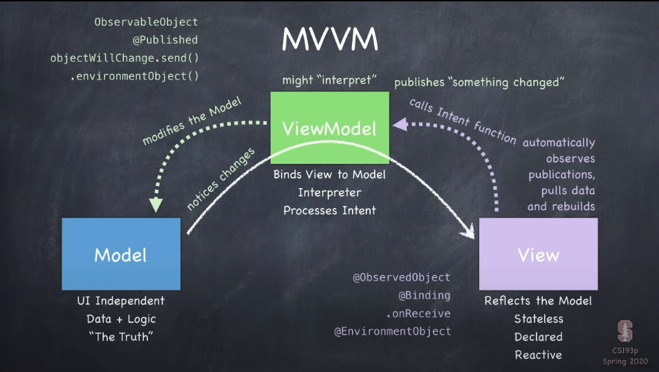

### 变量类型

struct class protocol Generics enum functions

#### struct 和 class

都含有存储变量、计算变量、常量、函数、构造函数。但struct是值类型，class是引用类型，引用类型由指针传递，对象存活在堆中。而struct是复制的，当把struct作为函数的参数时，函数得到的是它的复制。但是实际上Swift对于一些特定的值类型(集合类型：Array、Dictionary、Set)做了一些优化，在对于 Array 进行拷贝的时候，当传递的值进行改变的时候才会发生真正的拷贝。采用的是Copy-On-Write，也就是写时复制，当实际要写的时候才会复制，这针对的是特定的值类型。class是自动引用计数，为0的时候就会释放内存。struct支持函数编程，class支持面对对象编程。struct没有继承，而class有。struct的免费初始构造函数初始化所有变量，而class的初始构造函数不会初始化变量。struct变量的可变性要显式声明，使用mutating关键字，而类的变量总是可变的。MVVM中的ViewModel总是一个类，View是protocol

#### Genrics

泛型 

#### 函数作为类型

```swift
var operation: (Double) -> Double
operation = sqrt
let result = operation(4) // return 2
```

闭包，内联函数，将函数作为参数进行传递，以捕捉局部变量

```swift
// MARK: - 添加标记
```

struct要想能够迭代，就 必须是Identifiable的，

```swift
struct Card: Identifiable {
	var id: Int
}
```

## Lecture 3: Reactive UI 、 Protocols 和 Layout

### Reactive

模型一改变，视图也会变。使 ViewModel 实现 ObservableObject 协议，会有一个默认变量 objectWillChange，可以在函数中调用它的send()方法告诉其它人这个对象改变了。但是如果一个对象有好多地方改变都要通知的话，可以使用注解@Published更方便。然后在View里面把调用的ViewModel对象声明成@ObservedObject以接受订阅

### Protocol

Protocol是一种简约的struct或class，它具有函数和变量但是没有具体实现（或者存储）。它是一种Constrains and gains，如：

```swift
struct Tesla: Vehicle {
	// Tesla is constrained to have to implement everything in Vehicle
	// but gains all the capabilities a Vehicle has too
}
```

还可以为protocol添加实现，即使用 extension 来进行扩展，这是Swift进行函数编程的核心。

```swift
extension Vehicle {
	func registerWithDMV() { /* implementation here */}
}
```

extension也可以用来为struct和class添加额外的代码，也可以让它们实现其它的协议！

```swift
extension Boat: Moveable {
	//implement Moveable methods
}
```

为什么需要protocols？

是一种展现类型（structs/classes/other protocols）能够做什么的方式，也是其它代码想要获取其它类型行为的方式。也是一种函数编程的思想，使得专注于实用性并把实现细节隐藏在后面，和泛型组合会更加强大

```swift
protocol Greatness {
	func isGreaterThan(other: Self) -> Bool //Self是实现protocl的具体
}

extension Array where Element: Greatness {
	var greatest: Element {
		return the greatest by calling isGreaterThan on each Element
	}
}
```

### Enum

Swift的Enum具有函数和计算属性，能够存储每一个离散值的关联数据，为值类型。Enum 可以实现协议 CaseIterable，就可以调用.allCases

```swift
enum FastFoodMenuItem {
	case hamburger(numberOfPatties: Int)
	case fries
	case drink
	case cookie
  
  func isIncludedInSpecialOrder(number: Int) -> Bool {}
}
```


### Layout

屏幕上指向视图的空间是怎样的？

1. 容器View为里面的View提供空间，比如说HStack ZStack
2. View选择它们想要的大小
3. 容器View定位里面的View位置

容器Views

- Htack，VStack 里面的一个View确定了大小，那么HStack就会移除掉这部分空间，然后把剩余的空间分配给最小的可变的视图
- Foreach
- Modifiers（e.g. .padding()）修饰视图
- GeometryReader 

```swift
var body: View {
	GeometryReader { geometry in // parameter label
		. . .
	}
}
The geometry parameter is a GeometryProxy.
struct GeometryProxy {
	var size: CGSize //容器所能提供的大小
	func frame(in: CoordinateSpace) -> CGRect
	var safeAreaInsets: EdgeInsets
}
```

## Lecture 4: Grid 、 Enum 和 Optonals

作为参数的函数通过给定的参数返回一个View，但这个参数函数实际上没有在函数内被使用，只是被赋给了一个变量并在之后被调用，因此要给这个函数参数标记为@escaping，这就意味着这个参数函数会逃离这个函数不会被调用。Swift 必须很小心并且实际上知道如何处理这些可能会之后调用的函数。这也就是说为什么不能在闭包中使用局部变量的原因，因为它们要到之后这个函数执行的时候才会被处理。Swift 通过使函数类型变为引用类型，使他们存活在堆里，堆里的对象都有指针，这也就是参数函数为什么之后能够被调用。参数函数内的东西如果是类类型的话也会存活在堆里，那参数函数内的类会指向这个函数，而参数函数本身又指向这个类，引起循环引用，就会造成内存泄漏。加@escaping的作用就是为了检测会不会造成内存泄漏，以逃离初始化。

### Optionals

可选类型就是一个 enum

```swift
enum Optional<T> {
	case none
	case some(T)
}

var hello: String?		var hello: Optional<String> = .none
var hello: String? = "hello"		var hello: Optional<String> = .some("hello")
var hello: String? = nil		var hello: Optional<String> = .none
```

使用 if let = 语句保持不为空

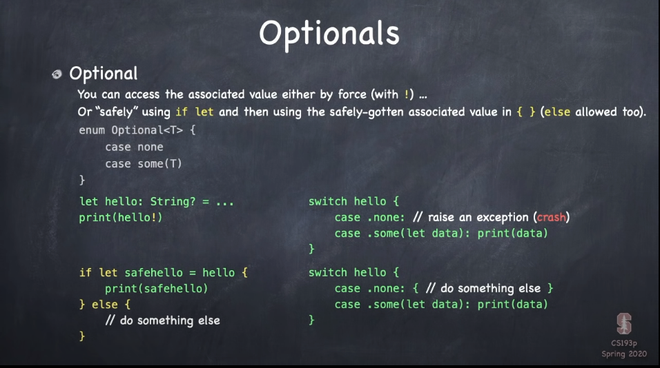

使用空合运算符 ??

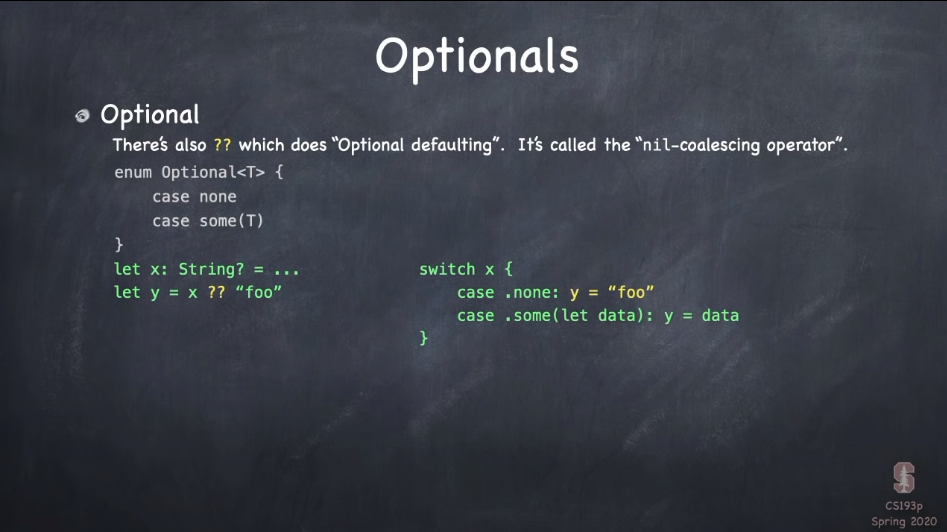

如果想要返回空视图的话使用Group

两个对象比较使用 == 要实现 Equatable 协议

## Lecture 5: ViewBuilder + Shape + ViewModifier

### Access Control

private、private(set)

### @ViewBuilder

支持“面向列表”的语法，@ViewBuilder可以在返回some VIew的函数或者只读的计算属性上进行标记，此时函数内的语句就变成了View的列表，其中组合的TupleView的个数被限制为10个以内

### Shape

Shape是一个继承了View的协议，Color、Image都实现了ShapeStyle，所以Shape可以调用.fill(S)

```swift
//实现自己的Shape
func path(in rect: CGRect) -> Path {
	return a Path
}
```

例子：Pie

```swift
import SwiftUI

struct Pie: Shape {
    var startAngle: Angle
    var endAngle: Angle
    var clockwise: Bool = false
    
    var animatableData: AnimatablePair<Double, Double> {
        get {
            return AnimatablePair(startAngle.radians, endAngle.radians)
        }
        set {
            startAngle = Angle.radians(newValue.first)
            endAngle = Angle.radians(newValue.second)
        }
    }
    func path(in rect: CGRect) -> Path {
        let radius = min(rect.height, rect.width) / 2
        let center = CGPoint(x: rect.midX, y: rect.midY)
        let start = CGPoint(
            x: center.x + radius * cos(CGFloat(startAngle.radians)),
            y: center.y + radius * sin(CGFloat(startAngle.radians))
        )
        var p = Path()
        p.move(to: center)
        p.addLine(to: start)
        p.addArc(center: center,
                 radius: radius,
                 startAngle: startAngle,
                 endAngle: endAngle,
                 clockwise: clockwise
        )
        p.addLine(to: center)
        
        return p
    }
    
    
}
```

### ViewModifier

aspectRatio, padding, font, foregroundColor都是ViewModifiers

```swift
protocol ViewModifier {
	associatedtype Content
	func body(content: Content) -> some View {
		return some View that represents a modification of content
	}
}
```

当我们对View进行.modifier的调用时，把这个ViewModifier传进去就行了，就会返回一个新的View

例如把一个文本卡片化：

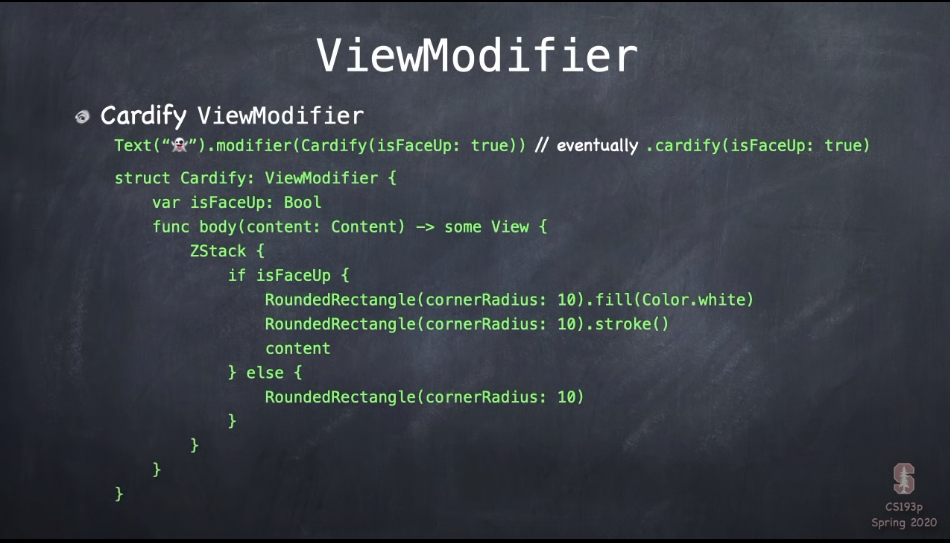

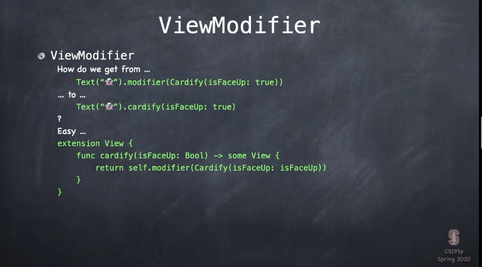

## Lecture 6: Animation

### Property Observers

一种观察变量是否变化的方法，若有变化并采取某种行动

### @State

View structs大部分状态下都是完全只读的，它们不需要它们自己的变量，所以也就完全没需要变成非仅可读的

什么时候需要状态？

存储暂时的东西，比如说进入编辑模式去收集用户意图的改变、暂时展示其它的 View 以通知用户、想要一个动画来设置动画结束点

```swift
@State var somthingTemporary: SomeType
```

实际上会在堆里面申请一些空间，因为View本身是只读的，当只读View重构时，新View会继续指向它，也就是说对View的改变不会丢弃这个状态。

### Animation

一种对UI的平稳的描绘随着一段时间的改变

什么能够做成动画？只有那些已经在屏幕上的容器中的View可以做动画 CTAAOS container that are already on screen

什么变化？CTAAOS中的VIew的外观出现和消失

如何做？

- 隐式方法，使用view modifier：.animation(Animation)，自动动画。如果作用在容器上，里面所有的东西都会有动画
- 显示方法，通过对可能改变的代码包装 withAnmation(Animation) {}

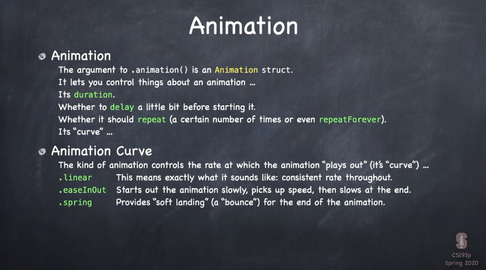

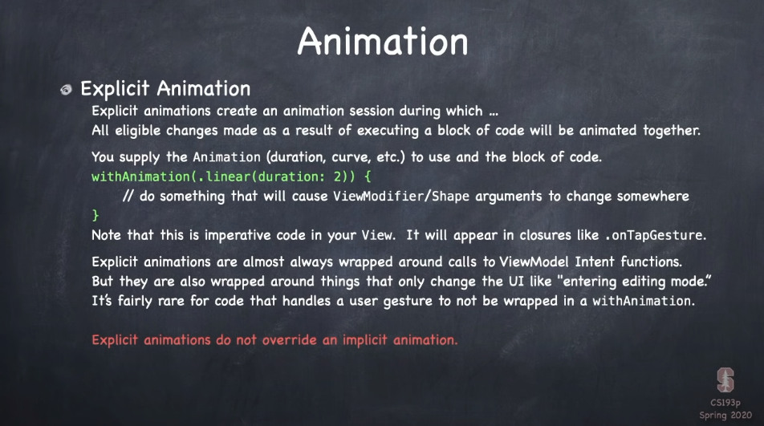

### Transitions

Transitions说明了如何对View的出现和解析进行过渡，使用方法:  .transition()。如果对容器视图使用Transition，如果是ZStack这种就是作用于整个，而Group或者ForEach这种就会到具体的内容视图。所有的transition API 是类型擦除的  

### .onAppear { } .rotationEffect()

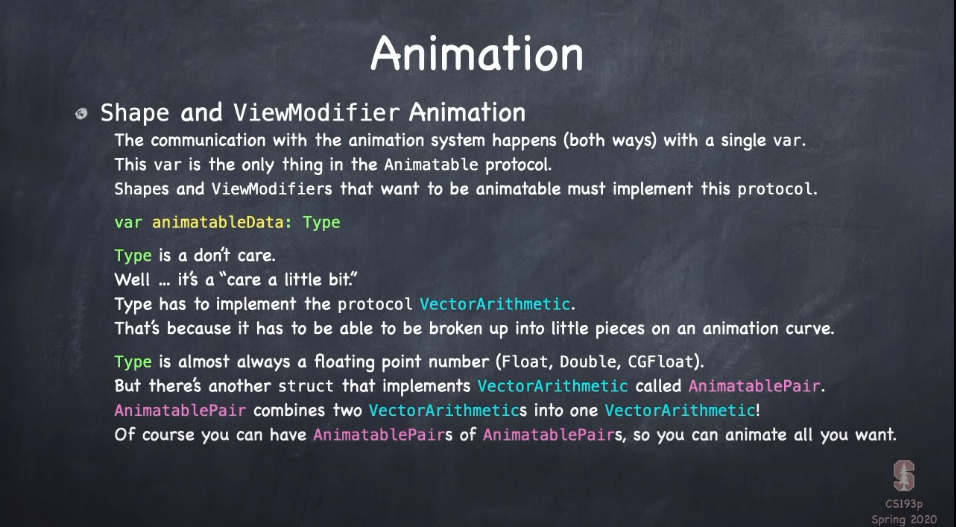

## Lecture 7: Multithreading

### Colors and Images

Color：color-specifier, ShapeStyle, View

UIColor: manipulate colors

Image and UIImage

### Multithreaded Programming

永远不要破坏UI

Queues 和 Closures

具体使用闭包实现队列中等待的代码，将闭包放入队列中

#### Main Queue

iOS中最重要的队列是 main queue，例如点击屏幕就会执行队列中的代码

#### Background Queues

主要是做非UI、长久的任务，main queue 比 background queues 有更高的优先级

#### GCD

负责queue管理的基础API叫做GCD（Grand Central DisPatch），具有两个基础的任务

1. 访问一个queue
2. 执行队列中的阻塞的代码

#### Creating a Queue

```swift
DispatchQueue.main // 所有UI代码必须发布的queue
DispatchQueue.global(qos: QoS) // 具有某种服务质量的非UI队列
```

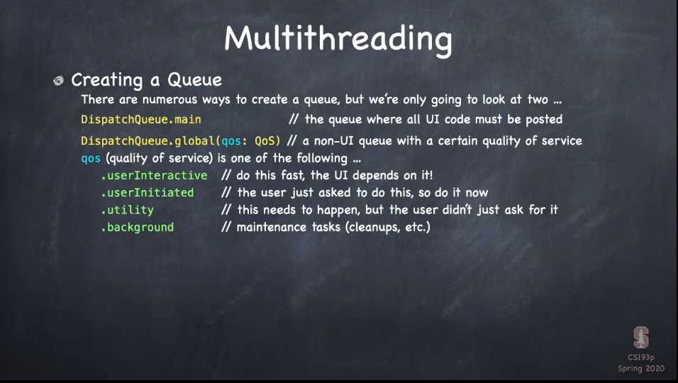


#### Plopping a Closure onto a Queue

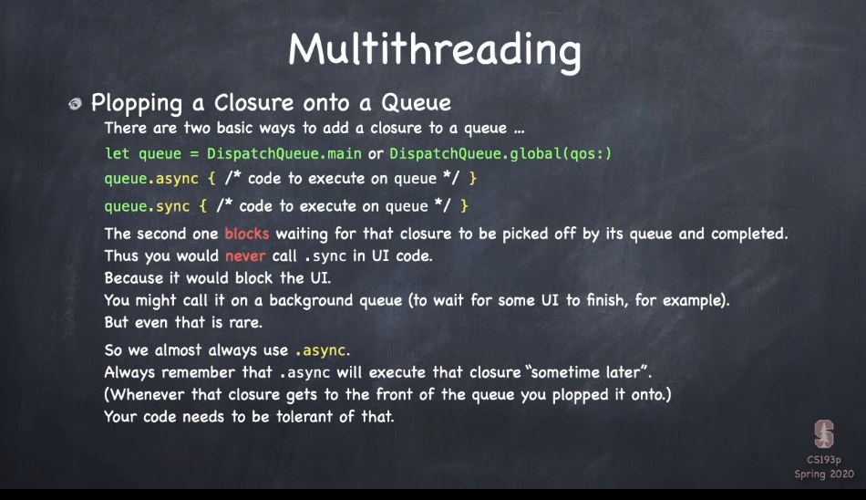

## Lecture 8: Gestures JSON

### UserDefaults

轻量级持久存储

#### Persistence

​	永久存储数据，有很多种方法：

- 文件系统
- SQL 数据库， CoreData
- iCloud
- CloudKit
- 第三方库，网络数据库
- UserDefaults，一种“持久字典”，适用于存储轻量级的信息，如用户偏好。有限制的存储数据类型

#### UserDefault 数据类型

UserDefault是个比较古老的API，只能够存储Property List。Swift 使用 Codable协议来将structs转换为Data对象

 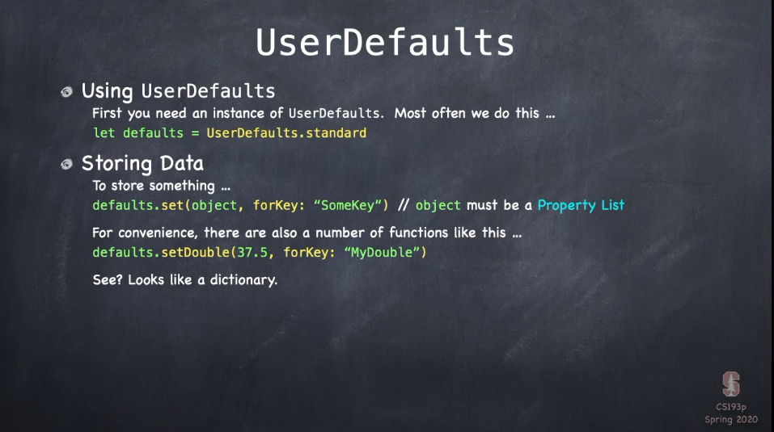

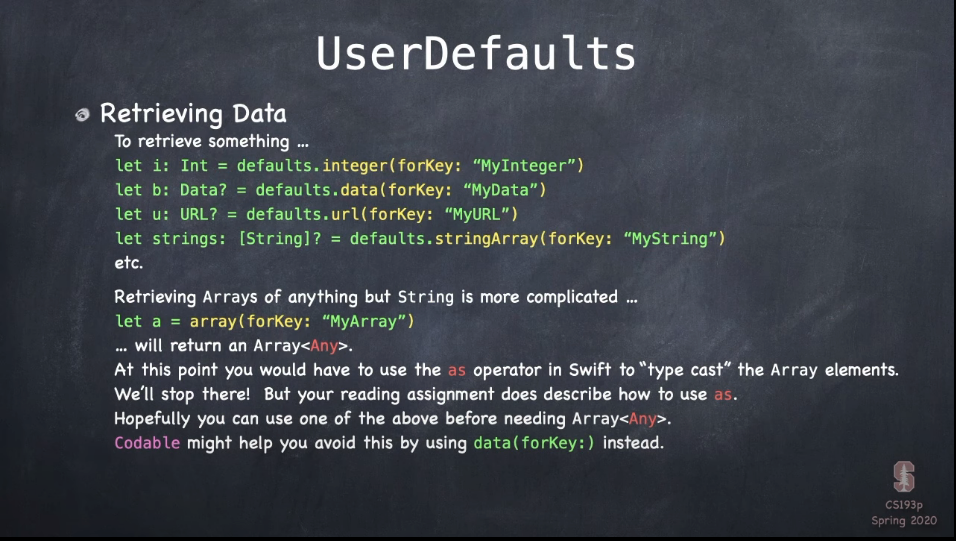

### Gestures

从使用手指的用户获得输入

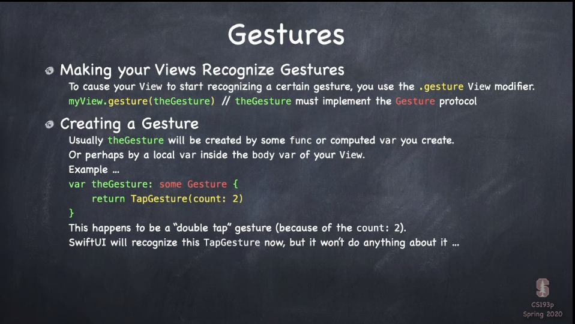

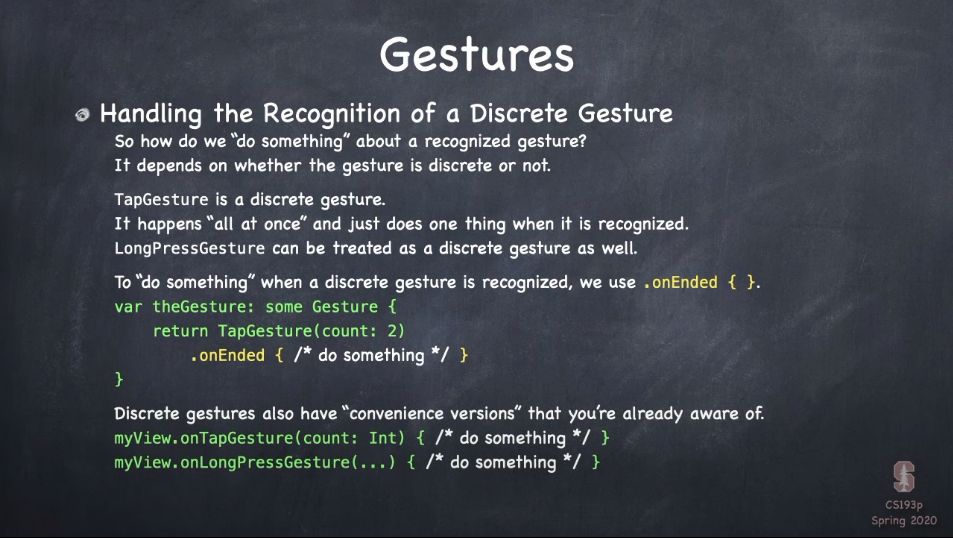

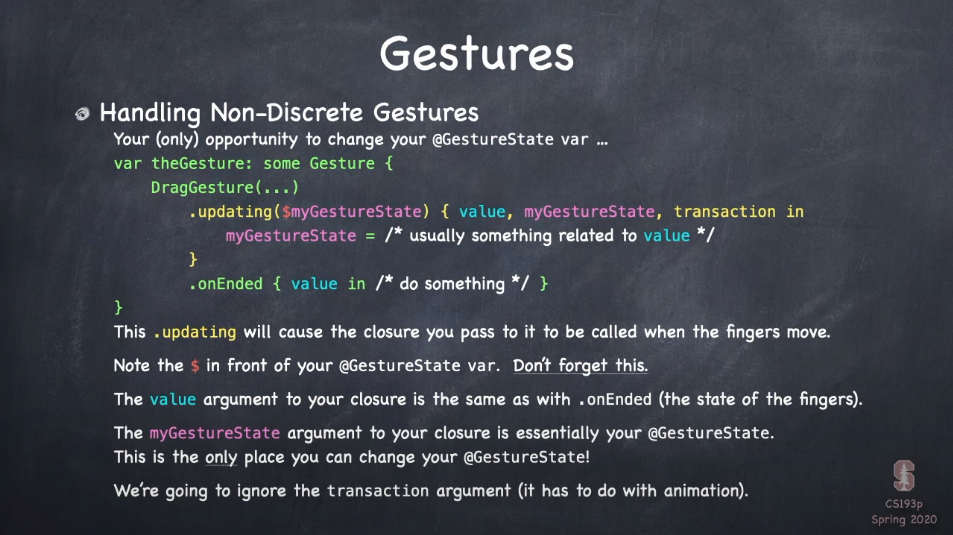

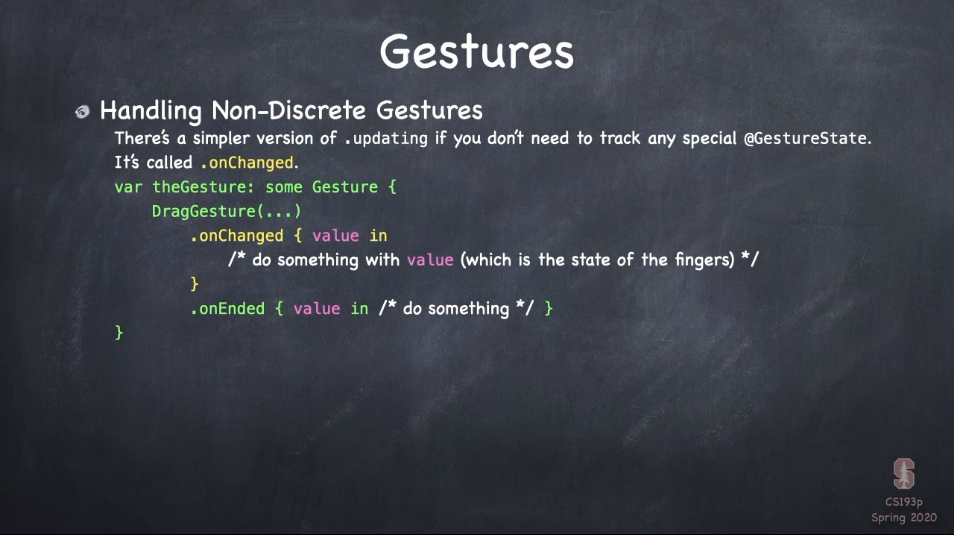